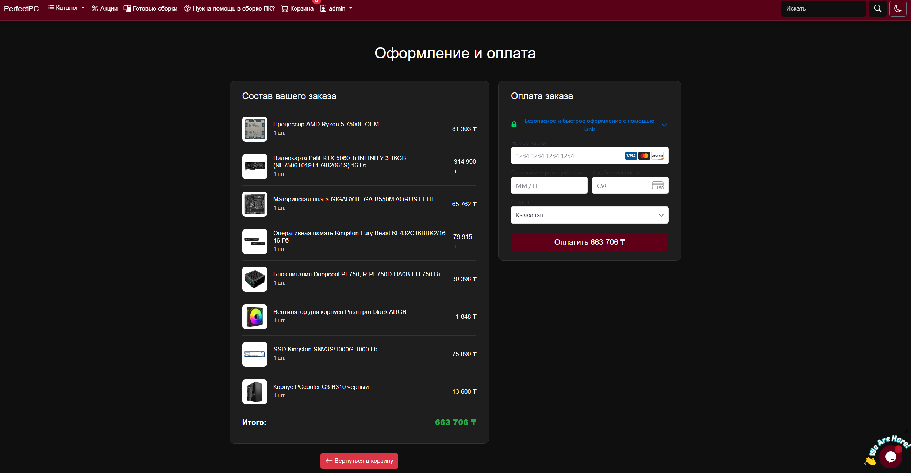

# 🛒 PerfectPC - Online Shop


PerfectPC is a full-featured e-commerce web application built with Python and Flask. It demonstrates a complete online shopping flow: from browsing products to adding them to a cart and processing payments via Stripe. The project is fully containerized using Docker and deployed on Render.

---

## 📸 Screenshots

### Main Page

*(Place a screenshot of your main page here)*

### Shopping Cart

*(Place a screenshot of your cart here)*

---

## ✨ Features

* **Product Catalog:** Browse products with dynamic content fetched from the database.
* **Shopping Cart:** Add, remove, and manage items in a session-based cart.
* **User Accounts:** User registration and authentication system.
* **Payment Integration:** Secure checkout process using **Stripe API**.
* **Database:** Robust data management using **PostgreSQL** and **SQLAlchemy** ORM.
* **Migrations:** Automatic database schema management with **Flask-Migrate**.
* **Containerization:** Fully dockerized environment for easy setup and deployment.

---

## 🛠️ Tech Stack

* **Backend:** Python 3.12, Flask
* **Database:** PostgreSQL
* **ORM:** SQLAlchemy
* **Payment Gateway:** Stripe
* **Containerization:** Docker, Docker Compose
* **WSGI Server:** Gunicorn
* **Hosting:** Render

---

## 🚀 How to Run Locally

You can run this project effortlessly using Docker.

### Prerequisites
* Docker & Docker Compose installed on your machine.
* Git.

### Steps

1.  **Clone the repository**
    ```bash
    git clone [https://github.com/HaoKann/online-shop-FLASK.git](https://github.com/HaoKann/online-shop-FLASK.git)
    cd online-shop-FLASK
    ```

2.  **Create an `.env` file**
    Create a file named `.env` in the root directory and add your configuration:
    ```env
    SECRET_KEY=your_secret_key
    SQLALCHEMY_DATABASE_URI=postgresql://user:password@db:5432/shopdb
    STRIPE_PUBLIC_KEY=your_stripe_public_key
    STRIPE_SECRET_KEY=your_stripe_secret_key
    ```

3.  **Build and Run**
    Run the following command to build the image and start the containers:
    ```bash
    docker-compose up --build
    ```

4.  **Access the Application**
    Open your browser and navigate to:
    ```
    http://localhost:8000
    ```
    *(Note: Database migrations are applied automatically on startup).*

---

## 📂 Project Structure

```text
online-shop-FLASK/
├── app/                 # Application source code
│   ├── controllers/     # Route logic (Blueprints)
│   ├── models.py        # Database models
│   ├── templates/       # HTML templates
│   └── static/          # CSS, JS, Images
├── migrations/          # Database migration versions
├── Dockerfile           # Docker image configuration
├── docker-compose.yml   # Docker services configuration
├── requirements.txt     # Python dependencies
└── run.py               # Entry point